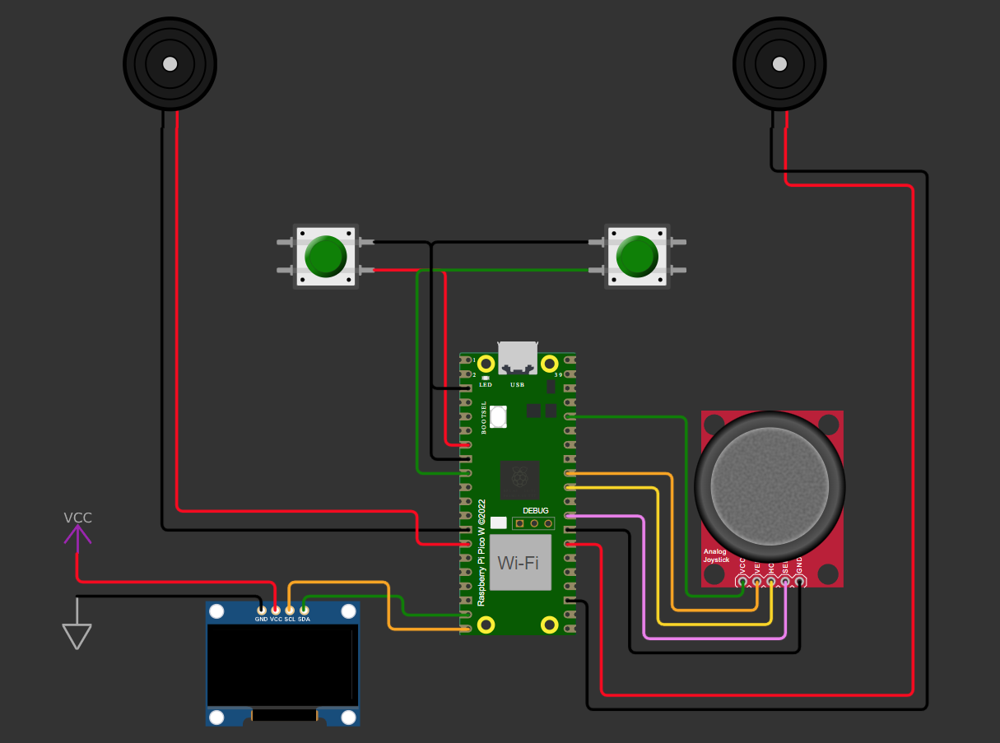

# Relatório do Projeto: Sistema de Menu Musical com Buzzer e Display OLED

---

## 1. Escopo do Projeto

### 1.1. Apresentação do Projeto
Este projeto consiste em um sistema embarcado que permite a seleção e reprodução de notas musicais através de um menu interativo exibido em um display OLED. O sistema é controlado por um joystick, que permite a navegação entre as notas, e dois botões adicionais, que modificam as notas para suas versões sustenido e bemol. O objetivo é criar uma interface intuitiva para seleção e reprodução de notas musicais, com feedback visual e sonoro.

### 1.2. Título do Projeto
**Sistema de Menu Musical com Buzzer e Display OLED**

### 1.3. Objetivos do Projeto
- Desenvolver um sistema de menu musical com navegação controlada por joystick.
- Implementar a reprodução de notas musicais através de um buzzer.
- Permitir a modificação das notas para sustenido e bemol utilizando botões.
- Exibir as notas selecionadas e suas alterações em um display OLED.
- Garantir uma experiência de usuário fluida, com resposta rápida e precisa aos comandos.

### 1.4. Descrição do Funcionamento
O sistema permite ao usuário navegar por um menu de notas musicais utilizando um joystick. Ao pressionar o botão do joystick, a nota selecionada é reproduzida através de um buzzer. Os botões A e B permitem modificar a nota para suas versões sustenido e bemol, respectivamente. O display OLED exibe o menu de notas, a nota selecionada e a nota atual sendo reproduzida.

### 1.5. Justificativa
O projeto justifica-se pela necessidade de uma interface simples e eficiente para seleção e reprodução de notas musicais, útil em aplicações educacionais e de entretenimento. A utilização de um microcontrolador e componentes de baixo custo torna o sistema acessível e fácil de reproduzir.

### 1.6. Originalidade
Embora existam projetos semelhantes na internet, este projeto destaca-se pela simplicidade e pela integração de um joystick para navegação e botões para modificação das notas. A utilização da placa BitDogLab 6.3 e a implementação de interrupções para os botões A e B são características inovadoras.

---

## 2. Especificação do Hardware

### 2.1. Diagrama em Bloco
O diagrama em bloco do projeto é composto pelos seguintes componentes:
- **Microcontrolador**: Raspberry Pi Pico (RP2040).
- **Display OLED**: SSD1306 (128x64 pixels, comunicação I2C).
- **Buzzer**: Piezoelétrico (MLT-8530).
- **Joystick**: Analógico com botão integrado.
- **Botões**: Dois botões para controle de sustenido e bemol.

### 2.2. Função de Cada Bloco
- **Microcontrolador**: Controla todos os componentes e executa o software.
- **Display OLED**: Exibe o menu de notas e a nota atual.
- **Buzzer**: Reproduz as notas musicais.
- **Joystick**: Permite a navegação no menu de notas.
- **Botões**: Modificam as notas para sustenido e bemol.

### 2.3. Configuração de Cada Bloco
- **Display OLED**: Configurado para comunicação I2C, utilizando os pinos GPIO 14 (SDA) e GPIO 15 (SCL).
- **Buzzer**: Conectado aos pinos GPIO 10 e GPIO 21, configurado para gerar frequências através de PWM.
- **Joystick**: Conectado aos pinos GPIO 26 (eixo X) e GPIO 27 (eixo Y), com o botão integrado conectado ao GPIO 22.
- **Botões**: Conectados aos pinos GPIO 5 (botão A) e GPIO 6 (botão B), com resistores pull-up de 10kΩ.

### 2.4. Comandos e Registros Utilizados
- **Display OLED**: Utiliza a biblioteca `ssd1306.h` para controle.
- **Buzzer**: Utiliza a biblioteca `hardware/pwm.h` para geração de frequências.
- **Joystick**: Utiliza a biblioteca `hardware/adc.h` para leitura dos eixos X e Y.
- **Botões**: Utilizam interrupções configuradas com a biblioteca `hardware/gpio.h`.

### 2.5. Descrição da Pinagem Usada
- **GPIO 14 (SDA)**: Comunicação I2C com o display OLED.
- **GPIO 15 (SCL)**: Comunicação I2C com o display OLED.
- **GPIO 10 e GPIO 21**: Conexão do buzzer.
- **GPIO 26 e GPIO 27**: Leitura dos eixos X e Y do joystick.
- **GPIO 22**: Botão do joystick.
- **GPIO 5 e GPIO 6**: Botões A e B.

### 2.6. Circuito Completo do Hardware
O circuito completo está representado na imagem abaixo feita no wokwi

---

## 3. Especificação do Firmware

### 3.1. Blocos Funcionais
- **Inicialização**: Configuração dos pinos GPIO, ADC, I2C e PWM.
- **Leitura do Joystick**: Atualização do cursor no menu de notas.
- **Reprodução de Notas**: Geração de frequências no buzzer.
- **Modificação de Notas**: Alteração das notas para sustenido e bemol.
- **Exibição no Display**: Atualização do menu e da nota atual.

### 3.2. Descrição das Funcionalidades
- **Inicialização**: Configura os pinos e inicializa o display OLED.
- **Leitura do Joystick**: Lê os valores dos eixos X e Y para mover o cursor.
- **Reprodução de Notas**: Gera a frequência correspondente à nota selecionada.
- **Modificação de Notas**: Altera a frequência da nota para sustenido ou bemol.
- **Exibição no Display**: Atualiza o menu e exibe a nota atual.

### 3.3. Definição das Variáveis
- `cursor_pos`: Posição do cursor no menu.
- `scroll_index`: Índice de rolagem do menu.
- `nota_tocando`: Indica se uma nota está sendo reproduzida.
- `nota_atual`: Índice da nota atual.
- `frequencia_atual`: Frequência da nota sendo reproduzida.

### 3.4. Fluxograma
O fluxograma do programa está representado na imagem abaixo.
.png>)

### 3.5. Inicialização
- Configuração dos pinos GPIO, ADC, I2C e PWM.
- Inicialização do display OLED.

### 3.6. Configurações dos Registros
- **PWM**: Configuração dos registros para geração de frequências.
- **ADC**: Configuração dos registros para leitura do joystick.

### 3.7. Estrutura e Formato dos Dados
- **Notas**: Estrutura contendo nome, oitava, frequência, frequência sustenido e frequência bemol.

### 3.8. Protocolo de Comunicação
- **I2C**: Utilizado para comunicação com o display OLED.

### 3.9. Formato do Pacote de Dados
- Não aplicável, pois não há comunicação externa.

---

## 4. Descrição Detalhada do Funcionamento do Projeto

### 4.1. Inicialização
O sistema começa com a inicialização dos componentes:
- **Display OLED**: Configurado para comunicação I2C, utilizando os pinos GPIO 14 (SDA) e GPIO 15 (SCL).
- **Buzzer**: Configurado para gerar frequências através de PWM, utilizando os pinos GPIO 10 e GPIO 21.
- **Joystick**: Configurado para leitura dos eixos X e Y, utilizando os pinos GPIO 26 e GPIO 27.
- **Botões**: Configurados para interrupções, utilizando os pinos GPIO 5 (botão A) e GPIO 6 (botão B).

### 4.2. Leitura do Joystick
O joystick é utilizado para navegar no menu de notas:
- **Eixo X**: Movimenta o cursor para cima e para baixo.
- **Eixo Y**: Não utilizado neste projeto.
- **Botão do Joystick**: Pressionado para iniciar ou parar a reprodução da nota selecionada.

### 4.3. Reprodução de Notas
Quando o botão do joystick é pressionado, a nota selecionada é reproduzida através do buzzer:
- **Frequência**: A frequência da nota é gerada utilizando PWM.
- **Duração**: A nota é reproduzida enquanto o botão do joystick estiver pressionado.

### 4.4. Modificação de Notas
Os botões A e B permitem modificar a nota selecionada:
- **Botão A**: Altera a nota para bemol (frequência reduzida).
- **Botão B**: Altera a nota para sustenido (frequência aumentada).

### 4.5. Exibição no Display
O display OLED exibe o menu de notas e a nota atual:
- **Menu de Notas**: Exibe as notas disponíveis, com o cursor (`>`) indicando a nota selecionada.
- **Nota Atual**: Exibe a nota sendo reproduzida, com o símbolo correspondente (bemol `b` ou sustenido `#`).

### 4.6. Fluxo de Execução
O fluxo de execução do sistema é o seguinte:
1. Inicialização dos componentes.
2. Leitura do joystick para atualizar o cursor no menu.
3. Verificação do botão do joystick para iniciar ou parar a reprodução da nota.
4. Verificação dos botões A e B para modificar a nota.
5. Atualização do display OLED com o menu e a nota atual.
6. Repetição do ciclo.

---

## 5. Execução do Projeto

### 5.1. Metodologia
- **Pesquisa**: Estudo de projetos semelhantes e definição dos requisitos.
- **Escolha do Hardware**: Seleção dos componentes com base nos requisitos.
- **Definição das Funcionalidades**: Especificação das funcionalidades do software.
- **Programação**: Desenvolvimento do código na IDE.
- **Depuração**: Testes e correção de erros.

### 5.2. Testes de Validação
- **Navegação no Menu**: Verificação do movimento do cursor e rolagem das notas.
- **Reprodução de Notas**: Teste das frequências geradas pelo buzzer.
- **Modificação de Notas**: Verificação das alterações para sustenido e bemol.
- **Exibição no Display**: Confirmação da correta exibição das notas e símbolos.

### 5.3. Discussão dos Resultados
O sistema responde corretamente aos comandos do joystick e botões. As notas são reproduzidas com clareza e precisão. O display OLED exibe as informações de forma clara e organizada.

---

## 6. Referências
- Documentação oficial do Raspberry Pi Pico: [https://www.raspberrypi.com/documentation/microcontrollers/](https://www.raspberrypi.com/documentation/microcontrollers/)
- Biblioteca SSD1306 para displays OLED: [https://github.com/adafruit/Adafruit_SSD1306](https://github.com/adafruit/Adafruit_SSD1306)
- Tutorial sobre PWM no Raspberry Pi Pico: [https://datasheets.raspberrypi.com/pico/raspberry-pi-pico-c-sdk.pdf](https://datasheets.raspberrypi.com/pico/raspberry-pi-pico-c-sdk.pdf)
- Repositório de inspiração: [https://github.com/lpfahler/Pico_Projects/blob/main/menu_jukebox_version_Final.py](https://github.com/lpfahler/Pico_Projects/blob/main/menu_jukebox_version_Final.py)
- Vídeo de inspiração: [https://youtu.be/mU3y9iTukI8?si=qbwEHjcGC4x-svSG](https://youtu.be/mU3y9iTukI8?si=qbwEHjcGC4x-svSG)

---

## Video explicativo do projeto

[AQUI!](https://youtu.be/CfrA_CtDFmg)

---